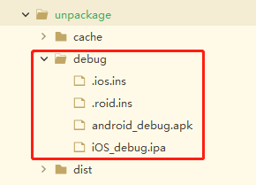
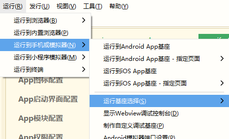

## uniapp在手机上运行时无运行基座选择选项

> 在多设备开发并且需要使用`自定义调试基座`运行时，常常会发现菜单栏里ing没有`运行基座选择选项`选项卡，官网文档也未找到该问题的解决方案，特此记录解决方案给各位，希望能帮助遇到相同情况的人

### 解决方案

**在生成自定义基座的电脑上、unpackage下有debug文件，里面有自定义调试基座的包，直接把该debug文件复制到新的开发设备的unpackage下、`运行基座选择选项`选项卡就会出现了**

实际上经过测试发现，debug包内保留相应安装包即可有效，但是为了保证没有问题还是建议把ins文件一起移植过去。